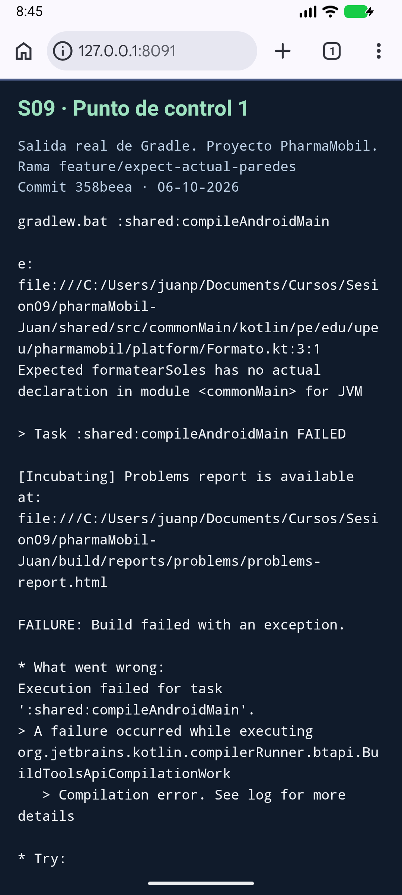
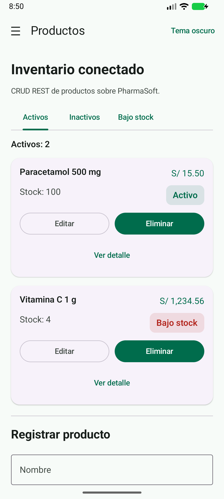
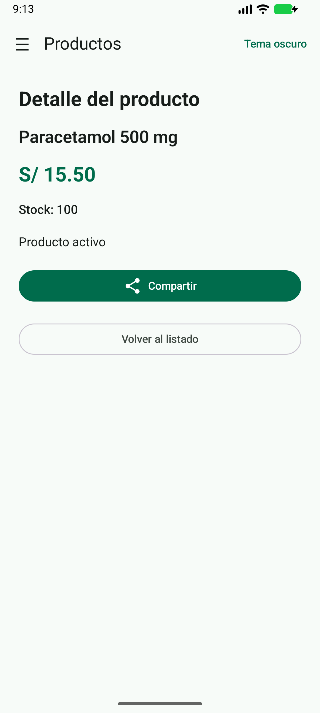
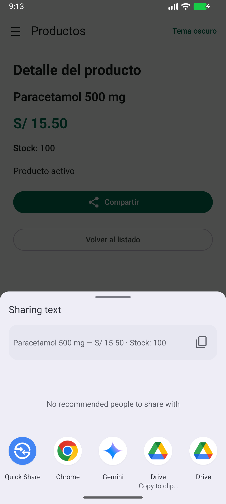

# Sesión 9 — expect/actual y capacidades nativas

**Integrante:** Juan Paredes Cárdenas · **Cuenta:** DJuanParedes  
**Fuente:** Guía Práctica N.º 09, 12 páginas, proporcionada por el estudiante.  
**Fecha de actividad autónoma indicada:** 12 de octubre de 2026, 23:59.

## Continuidad y commits propios

Repositorio: [DJuanParedes/pharmaMobil](https://github.com/DJuanParedes/pharmaMobil).
Rama: [feature/expect-actual-paredes](https://github.com/DJuanParedes/pharmaMobil/tree/feature/expect-actual-paredes).
Base: `actividad-autonoma-sesion-8`, commit `dd6a61ce62b9c0b6fc8401dce0ac34997841a870`.
Como no existía `develop`, se creó desde esa base; la funcionalidad previa se conserva.

| Commit publicado | Trabajo |
| --- | --- |
| [322f922](https://github.com/DJuanParedes/pharmaMobil/commit/322f9225a56d62685ff7ae65db0fd8107f2dfc3a) | Declaración expect y punto de control sin actual |
| [7563f2d](https://github.com/DJuanParedes/pharmaMobil/commit/7563f2de34ce5015c5a0a3533f2a2a37875c9fd8) | Actual Android/iOS y mapeo a ProductoUi |
| [113d424](https://github.com/DJuanParedes/pharmaMobil/commit/113d4242a745c69d718faf09fabc047bbb695b21) | Contrato, implementaciones, Koin, detalle y botón Compartir |
| [7505bde](https://github.com/DJuanParedes/pharmaMobil/commit/7505bde2f9bea95c08d33cb55fceb7b0c3cebc01) | Verificación macOS Kotlin/Swift y capturas XCTest |

Los commits publicados pertenecen a la cuenta autenticada DJuanParedes. Sus identificadores
difieren de los commits locales por la fecha y autoría del servicio de publicación; el
contenido implementado es el mismo. La guía pide una rama y tres commits de **cada**
integrante: este documento acredita a Juan. No se inventó un segundo integrante ni sus
commits. La entrega en el aula virtual requiere que el estudiante adjunte el enlace y
que su pareja aporte su propia rama, si corresponde.

## Diferencias de plataforma

| Aspecto | Android | iOS | Decisión común |
| --- | --- | --- | --- |
| Moneda | Java NumberFormat y locale es-PE | Foundation NSNumberFormatter y locale es_PE | expect/actual con firma y paquete idénticos |
| Compartir | Intent y selector de actividades | UIActivityViewController | Compartidor.compartir(texto) |
| Contexto | Aplicación; NEW_TASK en el chooser | Escena activa y controlador visible; popover en iPad | ViewModel no conoce el sistema operativo |
| Dependencias | Koin obtiene androidContext | Koin construye CompartidorIos | Koin resuelve la misma interfaz |
| Acceso al backend | 10.0.2.2 desde emulador | localhost desde simulador macOS | Mismo repositorio Ktor y endpoints reales |
| Compilación | Android SDK, Gradle y JDK | macOS, Xcode, Kotlin/Native | commonMain contiene reglas y pantallas |

El formato se calcula al mapear a `ProductoUi`, antes de mostrarlo. El dominio mantiene
el precio numérico. El texto para compartir se construye una sola vez en código común
con el guion largo `—` y el separador `·`; cada implementación sólo abre el selector.
El error de compartir se muestra conservando el detalle y se limpia si un reintento funciona.

## Lista de cotejo y puntos de control

| N.º | Criterio de la guía | Implementación / evidencia |
| --- | --- | --- |
| 1 | expect y dos actual | Tres archivos Formato del mismo paquete |
| 2 | Paquete y firma idénticos | pe.edu.upeu.pharmamobil.platform; formatearSoles(Double): String |
| 3 | Precio en ambas plataformas | Captura Android; verificación iOS en Actions y sus artefactos |
| 4 | Formato en presentación | Producto.toUi(); ProductoUi.precio es String |
| 5 | Interfaz en domain sin plataformas | domain/platform/Compartidor.kt |
| 6 | Dos implementaciones nativas | CompartidorAndroid y CompartidorIos |
| 7 | Koin en ambos módulos | single<Compartidor> en ambos PlatformModule; resolución Android ejecutada; iOS verificado por flujo XCTest |
| 8 | Botón y texto común | DetalleProductoScreen → ViewModel → comoTextoParaCompartir → Compartidor |
| 9 | Sin imports nativos en presentation | Búsqueda de imports android.* y platform.UIKit.* sin coincidencias |
| 10 | Capturas Android/iOS | Android capturado localmente; capturas iOS generadas por XCTest en macOS |

No debe marcarse la comprobación iOS como aprobada si el workflow falla: revisar su
resultado y artefactos antes de enviar la actividad. El código de iOS no puede validarse
con el compilador Windows.

**Punto de control 1.** Se compiló después del primer commit, antes de crear actual:
`Expected formatearSoles has no actual declaration in module <commonMain> for JVM`.
Se guardó el registro completo y una captura del mensaje real. La captura corresponde
a Chrome del emulador mostrando un visor del log Gradle; no es una captura de Android
Studio. El mensaje no fue recreado ni editado.

**Punto de control 2.** Tras los actual se compiló Android y se mostró el listado con
`S/ 15.50`. Ambos archivos actual conservan la firma y el paquete del expect.

**Punto de control 3.** `Compartidor` y `comoTextoParaCompartir()` se compilan como código
común, sin importar APIs Android ni iOS.

**Punto de control 4.** Android resolvió el Compartidor registrado en Koin al ejecutar el
botón del detalle. En iOS, XCTest comprueba la misma resolución al abrir la hoja nativa.
`MainApplication` conserva el registro de `androidContext()`.

**Punto de control 5.** La búsqueda de imports nativos en todo presentation no produjo
coincidencias. Ambas pantallas comunes se conectan exclusivamente al ViewModel.

**Verificación del paso 6.** Se ejecutó el detalle y el selector Android. El árbol de interfaz
capturado contiene `Paracetamol 500 mg — S/ 15.50 · Stock: 100`, con espacio no separable
introducido por el formateador. La prueba iOS realiza el mismo recorrido y copia el texto
de la hoja nativa para verificar nombre, precio y stock.

## Evidencias Android

Registros: [punto de control 1](../evidencias/sesion9/control1/compilacion-sin-actual.txt),
[compilación con formato](../evidencias/sesion9/android/compilacion-formato.txt),
[compilación y pruebas](../evidencias/sesion9/android/compilacion-y-pruebas.txt).
Las imágenes proceden de `adb exec-out screencap -p` en un emulador API 37 ejecutando
el APK compilado; no son maquetas. La jerarquía del selector está en `selector-compartir.xml`.

## Entorno reproducible y actividad autónoma

Se utilizó el backend oficial [dreyna/pharmaSoft](https://github.com/dreyna/pharmaSoft),
commit `6bc94e321f993c194789e9ce9d008a48813e0bf2`, con sus controladores y servicios
originales. Un POM temporal añade H2 en modo Oracle; se deshabilita Flyway y se usa
Hibernate create-drop exclusivamente para el laboratorio. No se cambió el código del
backend ni se simuló la respuesta HTTP. Se sembraron mediante POST reales una categoría
Medicamentos y los productos Paracetamol 500 mg (15.50, stock 100) y Vitamina C 1 g
(1234.56, stock 4). Son datos sintéticos, no un inventario de producción.

`ci/preparar_backend.py` y `ci/seed_backend.py` reproducen ese entorno. La verificación
macOS compila el framework y la aplicación Swift, ejecuta XCTest, exporta sus adjuntos
y guarda el texto compartido. Las capturas del listado y la hoja iOS deben tomarse de
esos adjuntos; si la ejecución falla, sus registros explican qué debe corregirse.

Las pruebas comunes del detalle cubren carga, mantenimiento del precio numérico,
texto con separadores exactos, ausencia de compartir durante carga, producto inexistente
y recuperación ante fallo nativo. Se ejecutan junto a las pruebas CRUD preexistentes.

Para inspeccionar interoperabilidad, revisar la cabecera `Shared.h` exportada en el
artefacto y los archivos Swift de iosApp. Las decisiones de estado permanecen en Kotlin;
Swift se limita a inicializar Koin y alojar el controlador Compose.

Se localizó y revisó también la ficha `sesion09_actividad_autonoma_diferencias_qkoyb3gpig.pdf`
(8 páginas) en Descargas. Su alcance adicional incluye el inventario completo, un informe
de 600 a 900 palabras, una tercera capacidad conectada a la interfaz y un único PDF.
La tercera capacidad elegida es información del dispositivo en la pantalla Acerca de.
